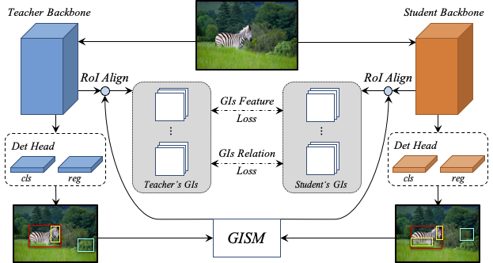
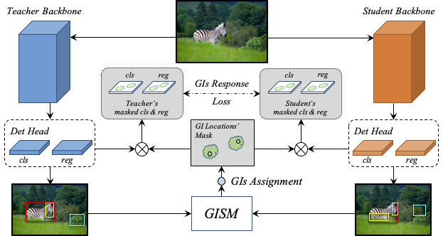

# Distill_GID_detectron2
Paper Link: [General Instance Distillation for Object Detection](https://openaccess.thecvf.com/content/CVPR2021/papers/Dai_General_Instance_Distillation_for_Object_Detection_CVPR_2021_paper.pdf)  

<div align="center">
    
    
    <br>

[GID Framework](dataset/)
</div>

## 1. Installation

### Step1. Clone repository

```
git clone gitlab@git.garena.com:xing.dai/ppl_algo.git
```

### Step2. Download COCO Dataset

The following code will download COCO2017 to path: `dataset/coco`.

```
cd dataset
./download_coco_2017.sh
```

### Step3. Install Pytorch

Example with `cuda-11.3` version:  

```
pip install torch==1.11.0 torchvision torchaudio --index-url https://download.pytorch.org/whl/cu113
```

### Step4. Install Detectron2

Current code is only work for detectron `0.4.x version` for compatibility reason. So you should build it from source with the following cmd:  

```
git clone https://github.com/facebookresearch/detectron2.git
git checkout v0.4.1
python -m pip install -e detectron2
```

## 2. Train

Every pipeline is defined in the `configs` directory. You can use the scripts in tools and corresponding config to visualize.

### Step1. Set Dataset Path

You should set the dataset directory path for train and evaluation. There are two ways (suppose you have downloaded coco2017 to path `dataset/coco`):  

1. Set to OS ENV:  
```export DETECTRON2_DATASETS=<GID_PATH>/dataset```

2. Set to every bash file:  
Details in every bash file (4/5th line), such as:  
`Distill_GID_detectron2/RetinaNet_Res50/train.sh`  
`Distill_GID_detectron2/RetinaNet_Res50/eval.sh`

### Step2. Train Student and Teacher

The training cmd format is as following:

```
# cd RetinaNet_Res50 or RetinaNet_Res101
CUDA_VISIBLE_DEVICES=0,1,... ./train.sh <config_file> <GPU_NUM> [<resume_dir>]
```

Example with 4 GPUs.

```
# Training ...
CUDA_VISIBLE_DEVICES=0,1,2,3 ./train.sh config/RetinaNet_2x_multi-scale.yaml 4

# Resume training ...
CUDA_VISIBLE_DEVICES=0,1,2,3 ./train.sh config/RetinaNet_2x_multi-scale.yaml 4 output_2x_multi-scale
```

### Step2. Distillation

The training cmd format is as following:

```
# cd GID
CUDA_VISIBLE_DEVICES=0,1,... ./train.sh <config_file> <GPU_NUM>
```

## 3. Eval

Every pipeline is defined in the `configs` directory. You can use the scripts in tools and corresponding config to visualize.

### Step1. Set Dataset Path

The same with section `Train`.

### Step2. Running

The evaluation cmd format is as following:

```
CUDA_VISIBLE_DEVICES=0 ./eval.sh <config_file> <model_weight>
```

---

This code is a reproduce version on detectron2, for the original version is realized in a private internal training framework. Due to some internal equipment resource reasons, we are unable to continue the accuracy alignment work and the code is reference only.
